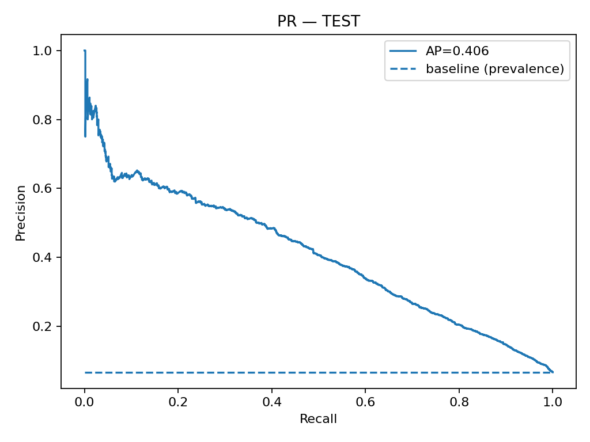

# Credit Scoring – Risk Tahmin (GiveMeSomeCredit)

Basit bir **kredi skorlama** pipeline’ı: veri temizleme → özellik üretimi (FE) → `XGBoost` modeli → **operasyon politikası** (Top-K veya maliyet-tabanlı eşik) → **Streamlit** demo.

## Sonuçlar (TEST)
- **ROC-AUC:** 0.869  
- **PR-AUC (AP):** 0.406 (prevalans ≈ 0.067)

| K   | TopK-Recall | Precision@K |
|-----|-------------|-------------|
| 5%  | 0.373       | 0.498       |
| 10% | 0.560       | 0.374       |
| 20% | 0.735       | 0.246       |

- **Maliyet-tabanlı eşik (VAL, FP=1 / FN=5):** `t ≈ 0.70` → TEST’te Recall ≈ 0.593 / Precision ≈ 0.347  
- **Seçilen politika:** **Top-K = %10** (VAL 90. yüzdelikten eşik ≈ **0.749**) → `models/policy.json`

## Proje yapısı


├─ app/streamlit_app.py # FE+Pre+Model pipeline'ı kullanan demo
├─ src/ # veri/fe/train utils
├─ models/
│ ├─ best_model.pkl # joblib pipeline (FE+Pre+Model)
│ ├─ preprocessor.pkl
│ ├─ feature_names.json
│ └─ policy.json # {"type":"topk","K":0.10,"threshold":0.7487}
├─ notebooks/ # 01_eda, 02_feature_engineering, 03_modeling
├─ data/raw/credit.csv
└─ reports/roc_test.png, pr_test.png, metrics.json


## Kurulum
```bash
pip install -r requirements.txt
python -m src.train --model xgb          # eğit, modeli kaydet
python -m streamlit run app/streamlit_app.py
```


Model

FE: gecikme toplamı/bayrakları, debtratio & util winsorize + log1p, gelir-eksik bayrağı, yaş bandı

Önişleme: sayısal median impute (+scale), kategorik most-freq impute + OHE

Model: XGBoost (dengesizlik için scale_pos_weight), AP (aucpr) ile early stopping

Skor → Karar: Top-K kapasite veya maliyet-tabanlı eşik (VAL’dan seçilir)

Neden PR-AUC ve Top-K?

Dengesiz veride ROC-AUC iyimser olabilir; PR-AUC pozitif sınıfı odakta değerlendirir. Operasyonel olarak günlük inceleme kapasitesi K% ise Top-K politikası doğrudan iş yüküyle hizalıdır.

Açıklanabilirlik

python src/explain.py   # SHAP local/global grafiklerini üretir (reports/ içine)


Görseller

ROC ve PR eğrileri

<p align="center">   </p>

Top-K ve Eşik Tarama

<p align="center">   </p>

Confusion Matrix (TEST @ t≈0.70)

<p align="center">  </p> ```
